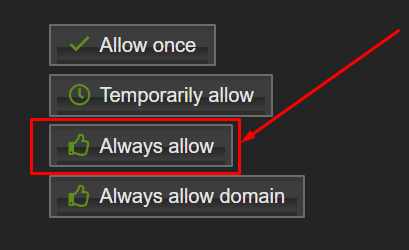
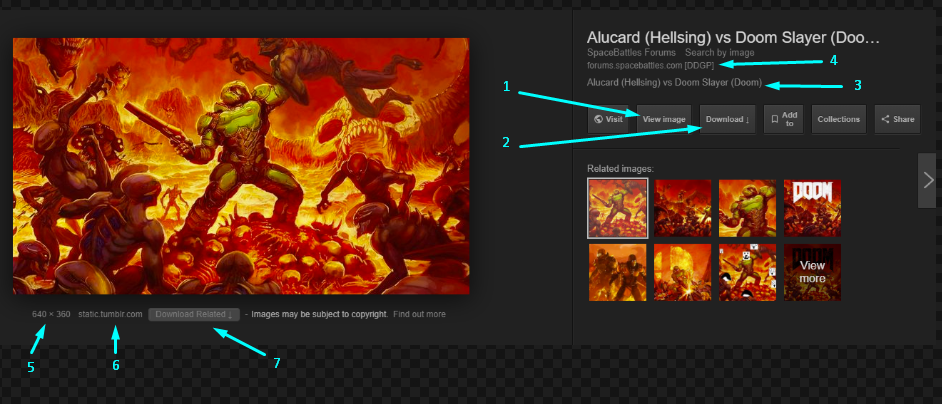

# SuperGoogle for Google Images

- [SuperGoogle for Google Images](#SuperGoogle-for-Google-Images)
  - [Description](#Description)
  - [Installation](#Installation)
    - [UserScript (Tampermonkey)](#UserScript-Tampermonkey)
    - [Browser extension](#Browser-extension)
  - [Usage](#Usage)
    - [Display original images](#Display-original-images)
    - [Zip and download all the images](#Zip-and-download-all-the-images)
    - [Enhance the image panels](#Enhance-the-image-panels)
    - [Hotkeys](#Hotkeys)
  - [External Libraries](#External-Libraries)
  - [Libraries](#Libraries)
  - [Documentation](#Documentation)
  - [Contributing](#Contributing)
  - [License](#License)

## Description

A [browser plugin](https://openuserjs.org/about/Userscript-Beginners-HOWTO) (a browser script/plugin/extension) to add features to Google images, like:  
display full resolution images, zip+download all images, and more. See a list of [all features here](#Features);

See [demo video here](https://youtu.be/ceFuBh8r8GQ?t=24).

## Installation

### UserScript (Tampermonkey)

1. Install [Tampermonkey](install:tampermonkey-chrome) (or any [UserScript client][guide:get-user-script]) for your browser.
2. Click [DOWNLOAD][download-link] (or visit the RAW file url).
3. [Optional: for downloading images] Enable downlaods  
    For Tampmonkey, do the following
      - Enable `Browser API`. See guide here: "[How do I setup userscript-triggered downloads][guide:browser-API-beta]".  
        ![enable browser API beta][guide:browser-API-beta-gif]
      - When prompted, allow the script to load images, click `always allow` (first time only).  
        

### Browser extension

Not yet supported, but coming soon!

## Usage

Open Google.com/....

TODO: write about usage

Below is a list of the available features, listed from what is (probably) most useful.

### Display original images

One of the most important features, replaces thumbnails with the original source images, even GIFs!

### Zip and download all the images

You can even specify the minimum allowed dimensions for images

### Enhance the image panels

Adds the following features to the image panel:

- 1 - Add `view image` button

    Bring back the old `view image` button! Now you won't have to visit the website just to see the fullres image.

- 2 - `download` button

    Directly download the image

- 3 - **Clickable description**

    Lookup the description text, open another Google images page searching for the description text

- 4 - **Proxy** button

    Try to use a proxy if the page is blocked

- 5 - Click to view images with **similar dimensions**

    I really missed this feature when Google removed it

- 6 - Clickable *image host* text

    Click the *image host* to search google for more images from that site. For example if it was hosted by `example.com`, then clicking it would open a google image search of "`site:example.com`"

- 7 - `Download Related` button

    Click to download this image and all the related images (the ones on the bottom right)

- 8 - Clickable *page host* text

    Click the *page host* to search google for more images from that site. For example if it was hosted by `example.com`, then clicking it would open a google image search of "`site:example.com`"

TODO: continue listing features

### Hotkeys

TODO: list hotkeys

## External Libraries

This script does use several other external libraries and scripts, they will be listed below with links to their sources.

Scripts

- [Google Direct Links for Pages and Images.user.js](lib/Google%20Direct%20Links%20for%20Pages%20and%20Images.user.js), [[source]](https://greasyfork.org/scripts/19210-google-direct-links-for-pages-and-images/code/Google:%20Direct%20Links%20for%20Pages%20and%20Images.user.js)

## Libraries

- [jQuery](https://jquery.com/)
- [Mousetrap.js](https://github.com/ccampbell/mousetrap) keybindings
- [progressbar.js](https://github.com/kimmobrunfeldt/progressbar.js/) progress bar when downloading
- [JSZip](https://github.com/Stuk/jszip) zip and compress functionality

## Documentation

[docs](docs/doc.md)

TODO: Add documentation

## Contributing

- Fork it!
- Create your feature branch: `git checkout -b my-new-feature`
- Commit your changes: `git commit -am 'Add some feature'`
- Push to the branch: `git push origin my-new-feature`
- Submit a pull request!

## License

[Apache License](LICENSE.md)  
Version 2.0, January 2004

[guide:get-user-script]: https://openuserjs.org/about/Userscript-Beginners-HOWTO#how-do-i-get-going-
[guide:userscript]: https://simply-how.com/enhance-and-fine-tune-any-web-page-the-complete-user-scripts-guide#section-2
[guide:browser-API-beta]: https://www.tampermonkey.net/faq.php#Q302
[guide:browser-API-beta-gif]: https://www.tampermonkey.net/images/animated/gm_download.gif
[download-link]: https://github.com/FarisHijazi/SuperGoogle/raw/master/SuperGoogle.user.js
[install:tampermonkey-chrome]: https://www.tampermonkey.net/index.php?ext=dhdg&browser=chrome
